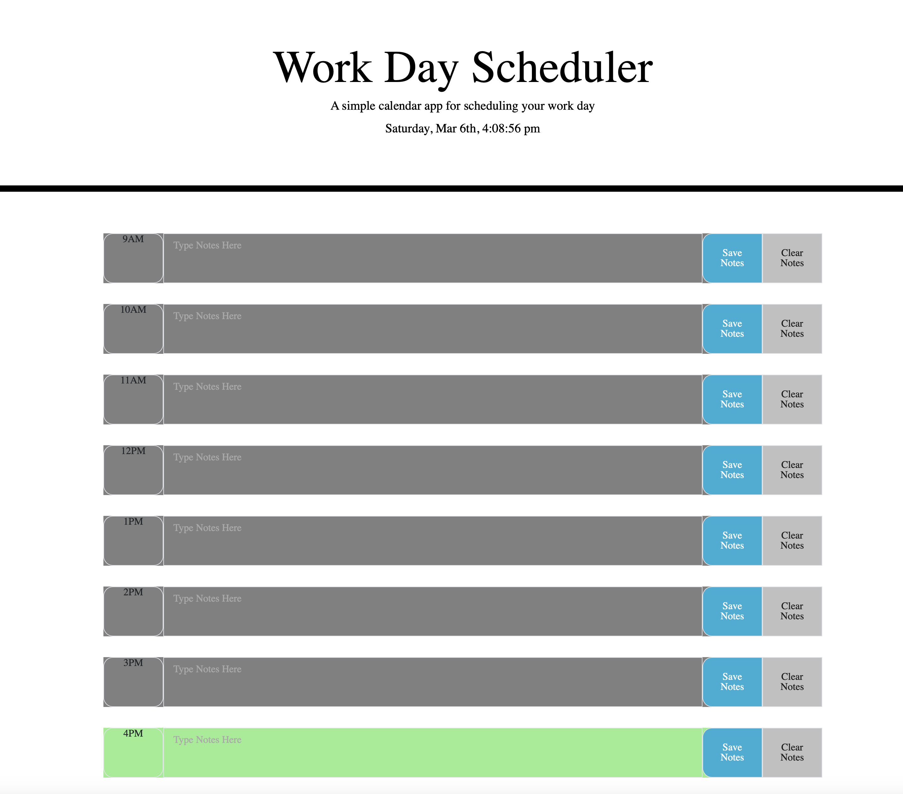

# Project: Third-Party APIs: Work Day Scheduler

  Deployable Link - > https://github.com/Wasabi311/Third-Party-APIs-Work-Day-Scheduler.git

## Table of Contents: 
- [Project: Third-Party APIs: Work Day Scheduler](#project-third-party-apis-work-day-scheduler)
  - [Table of Contents:](#table-of-contents)
  - [License:](#license)
  - [Description:](#description)
  - [Installation Instructions:](#installation-instructions)
  - [Images:](#images)

## License:

## Description:
Create a simple calendar application that allows a user to save events for each hour of the day by modifying starter code. This app will run in the browser and feature dynamically updated HTML and CSS powered by jQuery.

## Installation Instructions: 
Use Moment for time - https://momentjs.com/

## Images:

